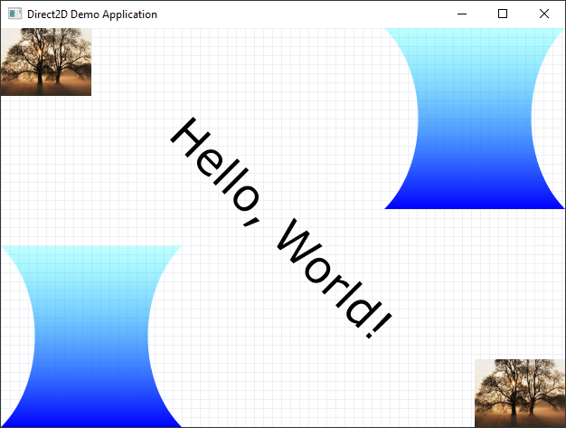

= nim-fww
ifdef::env-github,env-browser[:outfilesuffix: .adoc]

Nim bindings of various Win32 APIs for native Windows GUI application development (e.g. Direct2D, DirectWrite, WIC...).

Supports Nim v1.6.x, v2.0.x, v2.2.x.

== Available APIs

* https://learn.microsoft.com/en-us/windows/win32/direct2d/direct2d-portal[Direct2D]:
** Direct2D API bindings (`fww/d2d1`)
** Pure Nim Math library (`fww/d2d1_maths`)
** Typed API for https://learn.microsoft.com/en-us/windows/win32/direct2d/built-in-effects[Built-in Effects] (`fww/d2d1_effects`)
* https://learn.microsoft.com/en-us/windows/win32/directwrite/direct-write-portal[DirectWrite] (`fww/dwrite`)
* https://learn.microsoft.com/en-us/windows/win32/wic/-wic-lh[Windows Imaging Component (WIC)] (`fww/wic`)
* Clipboard (`fww/win32clipboard`)
* The COM Library (`fww/win32com`)
* Smart pointers for COM objects (`fww/comrefs`)
* https://learn.microsoft.com/en-us/windows/win32/winmsg/windowing[Windowing and Messaging]:
** Bindings for the Win32 Windows and Messaging API (`fww/win32wm`)
** `WM_*` constants (`fww/win32wmconsts`)
** (Extension) A high-level windowing framework (`fww/wmworks`)
* QueryPerformanceCounter (QPC) (`fww/win32qpc`)
* Threading and thread synchronization (`fww/win32threads`)
* The Windows Shell:
** Shell Filesystem operations (`fww/win32shellfs`)
** Drag-and-drop (`fww/win32dropfiles`)

(... more to come as needed)

== Demos

See the `demos/` directory for various demos.

=== SimpleDirect2DApplication

A port of Microsoft's https://learn.microsoft.com/en-us/samples/microsoft/windows-classic-samples/simple-direct-2d-application/[Simple Direct2D Application] code example to nim-fww.

This demo demonstrates the use of:

* Direct2D (`fww/d2d1`) for rendering.
* DirectWrite (`fww/dwrite`) for text layout.
* WIC (`fww/wic`) for image loading, resizing and pixel format conversion.
* `fww/win32wm` and `fww/wmworks` for creating windows and responding to events.
* `fww/winres` for compile-time generation of the resource object file with the application manifest and embedded data.

== Design notes

This project only focuses on native Win32 GUI development.
It does not aim for full API coverage (especially if the API is obsolete).
https://github.com/khchen/winim[winim] can be used (in conjunction with nim-fww) if full Win32 API coverage is needed.

== License

MIT License
